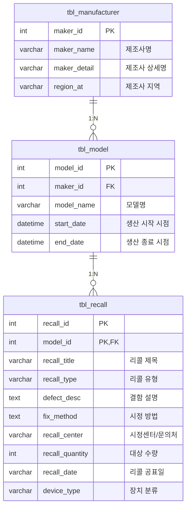

```mermaid
erDiagram
    tbl_manufacturer {
        int maker_id PK 
        varchar maker_name "제조사명"
        varchar maker_detail "제조사 상세명"
        varchar region_at "제조사 지역"
    }

    tbl_model {
        int model_id PK 
        int maker_id FK 
        varchar model_name "모델명"
        datetime start_date "생산 시작 시점"
        datetime end_date "생산 종료 시점"
    }

    tbl_recall {
        int recall_id PK 
        int model_id PK, FK 
        varchar recall_title "리콜 제목"
        varchar recall_type "리콜 유형"
        text defect_desc "결함 설명"
        text fix_method "시정 방법"
        varchar recall_center "시정센터/문의처"
        int recall_quantity "대상 수량"
        varchar recall_date "리콜 공표일"
        varchar device_type "장치 분류"
    }

    tbl_manufacturer ||--o{ tbl_model : "1:N"
    tbl_model ||--o{ tbl_recall : "1:N"
```
dsdf
